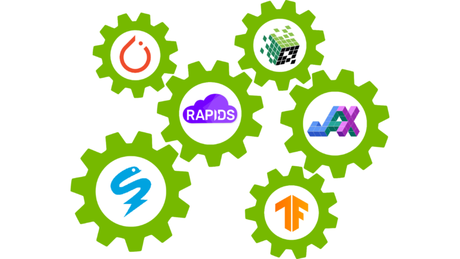

# Machine Learning Frameworks Interoperability

## Introduction

Efficient pipeline design is crucial for data scientists. When composing complex end-to-end workflows, you may choose from a wide variety of building blocks, each of them specialized for a dedicated task. Unfortunately, repeatedly converting between data formats is an error-prone and performance-degrading endeavor.

This notebook is part of a blog series where we discuss different aspects of efficient framework interoperability:

- In the [first post](https://developer.nvidia.com/blog/machine-learning-frameworks-interoperability-part-1-memory-layouts-and-memory-pools), we discussed pros and cons of distinct memory layouts as well as memory pools for asynchronous memory allocation to enable zero-copy functionality.
- In the [second post](https://developer.nvidia.com/blog/machine-learning-frameworks-interoperability-part-2-data-loading-and-data-transfer-bottlenecks/), we highlighted bottlenecks occurring during data loading/transfers and how to mitigate them using Remote Direct Memory Access (RDMA) technology.
- In the [third post](https://developer.nvidia.com/blog/machine-learning-frameworks-interoperability-part-3-zero-copy-in-action-using-an-e2e-pipeline/), we dive into the implementation of an end-to-end pipeline demonstrating the discussed techniques for optimal data transfer across data science frameworks.

To learn more on framework interoperability, check out our presentation at [NVIDIA’s GTC 2021 Conference.](https://www.nvidia.com/en-us/on-demand/session/gtcspring21-e32273/).